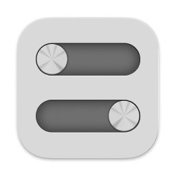

#  Knobby

This app exists because:

- I wanted a dead–simple “agent” app that could be quickly summoned whenever (stylishly if possible) and allow me to adjust the Mac’s volume and brightness with Vim key bindings.
- I wanted to play with latest Apple technologies (e.g. Sonoma’s SwiftUI, Observation…).

Requires macOS Sonoma. PRs most welcome!

## Install

As of macOS Sonoma and on Apple Silicon machines, the only reliable way to programmatically control the display’s brightness is through the private DisplayServices framework, which necessitates removing the app’s sandbox. This is why this app can’t be distributed through the App Store.

- Download and unzip the archive, then move the bundle to your applications folder.

## To Do

- App icon
- Settings:
	- 	Launch at login
	-	Showing/hiding the menu bar extra
- Tests
