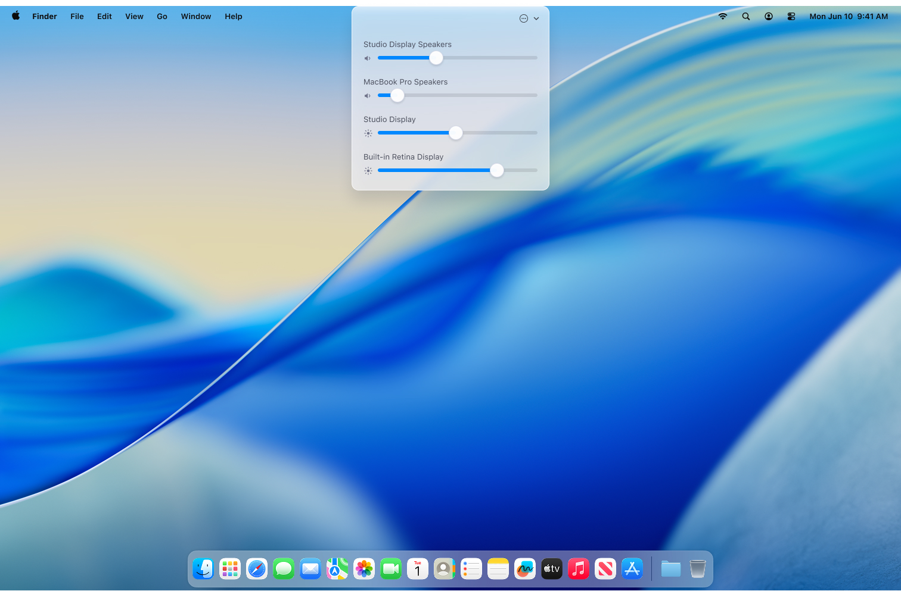

# Knobby

A tiny app to control your Mac’s volume and screen brightness with Vim key bindings.

**Requires macOS Sequoia.**

## Install

Download the latest release, mount the DMG and move the app bundle to your applications folder.

## Usage

Manipulating the currently focused setting (either volume or brightness):

| Key Binding  | Action          |
| ------------ | --------------- |
| <kbd>L</kbd> | Increase by 10% |
| <kbd>H</kbd> | Decrease by 10% |
| <kbd>J</kbd> | Set to 0%       |
| <kbd>K</kbd> | Set to 100%     |

General shortcuts:

| Key Binding    | Action                 |
| -------------- | ---------------------- |
| <kbd>Tab</kbd> | Change focused setting |
| <kbd>Esc</kbd> | Dismiss Knobby         |

## Acknowledgements

- [sindresorhus/KeyboardShortcuts](https://github.com/sindresorhus/KeyboardShortcuts)
